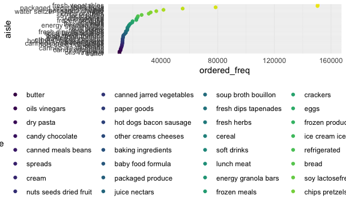

Homework 3
================

## Problem 1

Using instacart data

-   exploration of data set

-   number of aisles, most ordered items from aisles

-   plotting items ordered

``` r
library(p8105.datasets)
data("instacart") 
```

``` r
instacart %>% 
  count(aisle, name = "ordered_freq") %>% 
  arrange(desc(ordered_freq)) %>% 
  filter(ordered_freq > 10000) %>% 
  mutate(aisle =
           fct_reorder(aisle, ordered_freq)) %>% 
  ggplot(aes(x = aisle, y = ordered_freq, color = aisle)) +
  geom_point() +
  ylim(10000, 160000)+
  coord_flip()
```



There are 1384617 observations in `instacart` and the variables are
order\_id, product\_id, add\_to\_cart\_order, reordered, user\_id,
eval\_set, order\_number, order\_dow, order\_hour\_of\_day,
days\_since\_prior\_order, product\_name, aisle\_id, department\_id,
aisle, department. All variables are except for `eval_set`,
`product_name`, `aisle`, and `department` are class `integer`. The
variables named previously are class `character`. There are 134 aisles
represented in `instacart`. Fresh fruits and vegetables are the most
ordered items followed by pacakged vegetables and fruits.

``` r
instacart %>% 
  group_by(aisle, product_name) %>% 
   filter(aisle == "packaged vegetables fruits" | aisle == "dog food care" | aisle == "baking ingredients") %>%
  summarize(n_obs = n()) %>% 
   pivot_wider(
     names_from = product_name, 
     values_from = n_obs
   )
```

    ## `summarise()` has grouped output by 'aisle'. You can override using the `.groups` argument.

    ## # A tibble: 3 × 1,445
    ## # Groups:   aisle [3]
    ##   aisle   `1 to 1 Gluten F… `1-to-1 Baking Fl… `10\\" Graham R… `100% Cacao Nat…
    ##   <chr>               <int>              <int>            <int>            <int>
    ## 1 baking…                11                  7                5                2
    ## 2 dog fo…                NA                 NA               NA               NA
    ## 3 packag…                NA                 NA               NA               NA
    ## # … with 1,440 more variables:
    ## #   100% Cacao Unsweetened Chocolate Baking Bar <int>,
    ## #   100% Natural Stevia Sweetener <int>,
    ## #   100% Natural Sweetener Zero Calorie Packets <int>,
    ## #   100% Natural Zero Calorie Sweetener <int>,
    ## #   100% Organic Einkorn  All-Purpose Flour <int>,
    ## #   100% Organic Premium Whole Wheat Flour <int>, …

Make table showing the mean hour of the day when Pink Lady Apples and
Coffee Ice cream are ordered on each day of the week (2 x 7 table)

``` r
instacart %>% 
  select(product_name, order_hour_of_day, order_dow) %>% 
  filter(product_name == "Coffee Ice Cream" | product_name == "Pink Lady Apples") %>% 
  group_by(product_name, order_dow) %>% 
  summarize(
    mean_hour = mean(order_hour_of_day)
  ) %>% 
  mutate(order_dow = 
    recode(order_dow, 
           "0" = "Monday",
           "1" = "Tuesday",
           "2" = "Wednesday",
           "3" = "Thursday",
           "4" = "Friday",
           "5" = "Saturday",
           "6" = "Sunday")) %>% 
   pivot_wider(
    names_from = order_dow, 
    values_from = mean_hour)
```

    ## `summarise()` has grouped output by 'product_name'. You can override using the `.groups` argument.

    ## # A tibble: 2 × 8
    ## # Groups:   product_name [2]
    ##   product_name     Monday Tuesday Wednesday Thursday Friday Saturday Sunday
    ##   <chr>             <dbl>   <dbl>     <dbl>    <dbl>  <dbl>    <dbl>  <dbl>
    ## 1 Coffee Ice Cream   13.8    14.3      15.4     15.3   15.2     12.3   13.8
    ## 2 Pink Lady Apples   13.4    11.4      11.7     14.2   11.6     12.8   11.9

## Need to do:

-   give illustrative example of observations

-   Make a table showing the three most popular items in each of the
    aisles “baking ingredients”, “dog food care”, and “packaged
    vegetables fruits”. Include the number of times each item is ordered
    in your table.

## Problem 2

``` r
library(p8105.datasets)
data("brfss_smart2010") 
```

``` r
brfss_smart2010 %>% 
  janitor::clean_names() %>% 
  filter(topic == "Overall Health",
         response == "Excellent" | response == "Very good" | response == "Good" | response == "Fair" | response == "Poor") %>% 
  mutate(response = forcats::fct_relevel(response, c("Poor", "Fair", "Good", "Very good", "Excellent"))
  ) 
```

    ## # A tibble: 10,625 × 23
    ##     year locationabbr locationdesc  class  topic  question  response sample_size
    ##    <int> <chr>        <chr>         <chr>  <chr>  <chr>     <fct>          <int>
    ##  1  2010 AL           AL - Jeffers… Healt… Overa… How is y… Excelle…          94
    ##  2  2010 AL           AL - Jeffers… Healt… Overa… How is y… Very go…         148
    ##  3  2010 AL           AL - Jeffers… Healt… Overa… How is y… Good             208
    ##  4  2010 AL           AL - Jeffers… Healt… Overa… How is y… Fair             107
    ##  5  2010 AL           AL - Jeffers… Healt… Overa… How is y… Poor              45
    ##  6  2010 AL           AL - Mobile … Healt… Overa… How is y… Excelle…          91
    ##  7  2010 AL           AL - Mobile … Healt… Overa… How is y… Very go…         177
    ##  8  2010 AL           AL - Mobile … Healt… Overa… How is y… Good             224
    ##  9  2010 AL           AL - Mobile … Healt… Overa… How is y… Fair             120
    ## 10  2010 AL           AL - Mobile … Healt… Overa… How is y… Poor              66
    ## # … with 10,615 more rows, and 15 more variables: data_value <dbl>,
    ## #   confidence_limit_low <dbl>, confidence_limit_high <dbl>,
    ## #   display_order <int>, data_value_unit <chr>, data_value_type <chr>,
    ## #   data_value_footnote_symbol <chr>, data_value_footnote <chr>,
    ## #   data_source <chr>, class_id <chr>, topic_id <chr>, location_id <chr>,
    ## #   question_id <chr>, respid <chr>, geo_location <chr>
