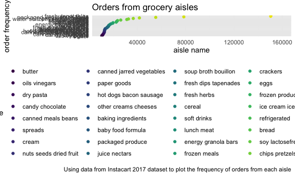
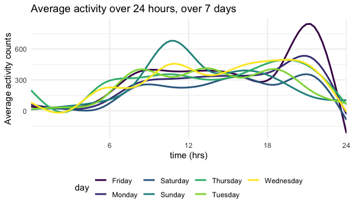

Homework 3
================

## Problem 1

Using instacart data

-   exploration of data set

-   number of aisles, most ordered items from aisles

-   plotting items ordered

``` r
library(p8105.datasets)
data("instacart") 
```

Plotting some initial observations

``` r
instacart %>% 
  count(product_name, name = "count") %>% 
  ggplot(aes(x = product_name, y = count)) + geom_point()
```


``` r
instacart %>% 
  count(aisle, name = "ordered_freq") %>% 
  arrange(desc(ordered_freq)) %>% 
  filter(ordered_freq > 10000) %>% 
  mutate(aisle =
           fct_reorder(aisle, ordered_freq)) %>% 
  ggplot(aes(x = aisle, y = ordered_freq, color = aisle)) +
  geom_point() +
  ylim(10000, 160000)+
  coord_flip() +
  labs(title = "Orders from grocery aisles", 
       x = "order frequency", 
       y = "aisle name", 
       caption = "Using data from Instacart 2017 dataset to plot the frequency of orders from each aisle")
```



There are 1384617 observations in `instacart` and the variables are
order\_id, product\_id, add\_to\_cart\_order, reordered, user\_id,
eval\_set, order\_number, order\_dow, order\_hour\_of\_day,
days\_since\_prior\_order, product\_name, aisle\_id, department\_id,
aisle, department. All variables are class `integer` except for
`eval_set`, `product_name`, `aisle`, and `department` are class
`integer`. The variables named previously are class `character`. There
are 134 aisles represented in `instacart`. Fresh fruits and vegetables
are the most ordered items followed by pacakged vegetables and fruits.

### Making table with 3 most popular items in 3 aisles

``` r
pop_products = 
instacart %>% 
  group_by(aisle, product_name) %>% 
   filter(aisle %in% c("packaged vegetables fruits", "dog food care","baking ingredients")) %>%
  summarize(n_obs = n()) %>% 
    arrange(desc(n_obs)) %>% 
   slice(1:3) %>% 
    knitr::kable(digits = 1)
```

    ## `summarise()` has grouped output by 'aisle'. You can override using the `.groups` argument.

Make table showing the mean hour of the day when Pink Lady Apples and
Coffee Ice cream are ordered on each day of the week (2 x 7 table)

``` r
instacart %>% 
  select(product_name, order_hour_of_day, order_dow) %>% 
  filter(product_name == "Coffee Ice Cream" | product_name == "Pink Lady Apples") %>% 
  group_by(product_name, order_dow) %>% 
  summarize(
    mean_hour = mean(order_hour_of_day)
  ) %>% 
  mutate(order_dow = 
    recode(order_dow, 
           "0" = "Monday",
           "1" = "Tuesday",
           "2" = "Wednesday",
           "3" = "Thursday",
           "4" = "Friday",
           "5" = "Saturday",
           "6" = "Sunday")) %>% 
   pivot_wider(
    names_from = order_dow, 
    values_from = mean_hour)
```

    ## `summarise()` has grouped output by 'product_name'. You can override using the `.groups` argument.

    ## # A tibble: 2 × 8
    ## # Groups:   product_name [2]
    ##   product_name     Monday Tuesday Wednesday Thursday Friday Saturday Sunday
    ##   <chr>             <dbl>   <dbl>     <dbl>    <dbl>  <dbl>    <dbl>  <dbl>
    ## 1 Coffee Ice Cream   13.8    14.3      15.4     15.3   15.2     12.3   13.8
    ## 2 Pink Lady Apples   13.4    11.4      11.7     14.2   11.6     12.8   11.9

## Problem 2

Loading brfss data

``` r
library(p8105.datasets)
data("brfss_smart2010") 
```

Data cleaning

-   Overall health, creating ordered responses “poor” to “excellent”

# Need to do

-   how many states observed at 7 or more locations in 2002 and 2010?

``` r
brfss_smart2010 %>% 
  janitor::clean_names() %>% 
  filter(topic == "Overall Health",
         response == "Excellent" | response == "Very good" | response == "Good" | response == "Fair" | response == "Poor") %>% 
  mutate(response = forcats::fct_relevel(response, c("Poor", "Fair", "Good", "Very good", "Excellent"))
  ) %>%
  filter(year == 2002) %>% 
 separate(locationdesc, into = c("state", "county"), convert = TRUE) %>% 
  group_by(state) %>% 
  count(state, name = "n_locations") %>% arrange(desc(n_locations)) %>% 
  filter(n_locations > 7)
```

    ## Warning: Expected 2 pieces. Additional pieces discarded in 785 rows [1, 2, 3, 4,
    ## 5, 6, 7, 8, 9, 10, 11, 12, 13, 14, 15, 16, 17, 18, 19, 20, ...].

    ## # A tibble: 36 × 2
    ## # Groups:   state [36]
    ##    state n_locations
    ##    <chr>       <int>
    ##  1 PA             50
    ##  2 MA             40
    ##  3 NJ             40
    ##  4 CT             35
    ##  5 FL             35
    ##  6 NC             35
    ##  7 MD             30
    ##  8 NH             25
    ##  9 NY             25
    ## 10 UT             25
    ## # … with 26 more rows

There are 36 states with over 7 locations in 2002.

2010:

``` r
brfss_smart2010 %>% 
  janitor::clean_names() %>% 
  filter(topic == "Overall Health",
         response == "Excellent" | response == "Very good" | response == "Good" | response == "Fair" | response == "Poor") %>% 
  mutate(response = forcats::fct_relevel(response, c("Poor", "Fair", "Good", "Very good", "Excellent"))
  ) %>%
  filter(year == 2010) %>% 
 separate(locationdesc, into = c("state", "county"), convert = TRUE) %>% 
  group_by(state) %>% 
  count(state, name = "n_locations") %>% arrange(desc(n_locations)) %>% 
  filter(n_locations > 7)
```

    ## Warning: Expected 2 pieces. Additional pieces discarded in 1510 rows [1, 2, 3,
    ## 4, 5, 6, 7, 8, 9, 10, 11, 12, 13, 14, 15, 16, 17, 18, 19, 20, ...].

    ## # A tibble: 45 × 2
    ## # Groups:   state [45]
    ##    state n_locations
    ##    <chr>       <int>
    ##  1 FL            205
    ##  2 NJ             95
    ##  3 TX             80
    ##  4 CA             60
    ##  5 MD             60
    ##  6 NC             60
    ##  7 NE             50
    ##  8 WA             50
    ##  9 MA             45
    ## 10 NY             45
    ## # … with 35 more rows

There are 45 states with over 7 locations in 2002.

# dataset - response = excellent

``` r
brfss_df = brfss_smart2010 %>% 
  janitor::clean_names() %>% 
  filter(response == "Excellent") %>% 
  group_by(year, locationabbr, data_value)
```

## Problem 3

Loading accel data

``` r
accel_df = read_csv("./data/accel_data.csv") %>% 
  janitor::clean_names() %>% 
  rename_with( ~ str_replace(., "activity_", paste0("minute_", seq_along(along.with = NULL)))) %>% 
  mutate(weekend_vs_weekday =
    recode(day, "Saturday" = "Weekend", "Sunday" = "Weekend", "Monday" = "Weekday", "Tuesday" = "Weekday", "Wednesday" = "Weekday", "Thursday" = "Weekday", "Friday" = "Weekday")) %>% 
  select(week, day_id, weekend_vs_weekday, everything()) 
```

    ## Rows: 35 Columns: 1443

    ## ── Column specification ────────────────────────────────────────────────────────
    ## Delimiter: ","
    ## chr    (1): day
    ## dbl (1442): week, day_id, activity.1, activity.2, activity.3, activity.4, ac...

    ## 
    ## ℹ Use `spec()` to retrieve the full column specification for this data.
    ## ℹ Specify the column types or set `show_col_types = FALSE` to quiet this message.

There are 35 observations in `accel`and the variables are week, day\_id,
weekend\_vs\_weekday, and `minute_1` to `minute_1440`. All variables are
`numeric` except for `weekend_vs_weekday` and `day` which are class
`character`.

Aggregate over data for total activity for entire day

-   making table for aggregated activity `minute_1:minute_1440`

``` r
accel_df %>% 
  rowwise() %>% 
  mutate(total_activity = sum(c_across(minute_1:minute_1440), na.rm = TRUE)) %>%
  select(day_id, day, total_activity)
```

    ## # A tibble: 35 × 3
    ## # Rowwise: 
    ##    day_id day       total_activity
    ##     <dbl> <chr>              <dbl>
    ##  1      1 Friday           480543.
    ##  2      2 Monday            78828.
    ##  3      3 Saturday         376254 
    ##  4      4 Sunday           631105 
    ##  5      5 Thursday         355924.
    ##  6      6 Tuesday          307094.
    ##  7      7 Wednesday        340115.
    ##  8      8 Friday           568839 
    ##  9      9 Monday           295431 
    ## 10     10 Saturday         607175 
    ## # … with 25 more rows

-   looking for trends in `total_activity`

``` r
accel_df %>% 
  rowwise() %>% 
  mutate(total_activity = sum(c_across(minute_1:minute_1440), na.rm = TRUE)) %>% 
  mutate(as.integer(total_activity)) %>% 
  select(day_id, day, total_activity) %>% 
  group_by(day) %>% 
  summarize(mean_activity = mean(total_activity))
```

    ## # A tibble: 7 × 2
    ##   day       mean_activity
    ##   <chr>             <dbl>
    ## 1 Friday          458342.
    ## 2 Monday          371740.
    ## 3 Saturday        273847.
    ## 4 Sunday          383843.
    ## 5 Thursday        418230.
    ## 6 Tuesday         359848.
    ## 7 Wednesday       425954.

From the `accel` data, looking at `total_activity`, on average, `Friday`
has the most activity, followed by `Wednesday` and `Thursday`. On
average, `Saturday` has the lowest activity score.

Making a plot for activity in 24 hour period for each day of the week.

``` r
accel_df %>% 
  select(day, minute_1:minute_1440) %>% 
  pivot_longer(
    minute_1:minute_1440,
    names_to = "time",
    values_to = "activity") %>% 
   separate(time, into = c("unit", "min_num"), convert = TRUE) %>% mutate(min_num = min_num) %>% 
  mutate(min_num = as.numeric(min_num)) %>% 
  group_by(day, min_num) %>% 
  summarize(avg_activity = mean(activity)) %>% 
  ggplot(aes(x = min_num, y = avg_activity, color = day)) + geom_smooth(se = FALSE) +
  scale_x_discrete(limit = c(360, 720, 1080, 1440),
                   labels = c("6", "12", "18", "24")) +
  labs(
    title = "Average activity over 24 hours, over 7 days",
    x = "time (hrs)",
    y = "Average activity counts",
    color = "day"
  )
```

    ## `summarise()` has grouped output by 'day'. You can override using the `.groups` argument.

    ## Warning: Continuous limits supplied to discrete scale.
    ## Did you mean `limits = factor(...)` or `scale_*_continuous()`?

    ## `geom_smooth()` using method = 'gam' and formula 'y ~ s(x, bs = "cs")'


